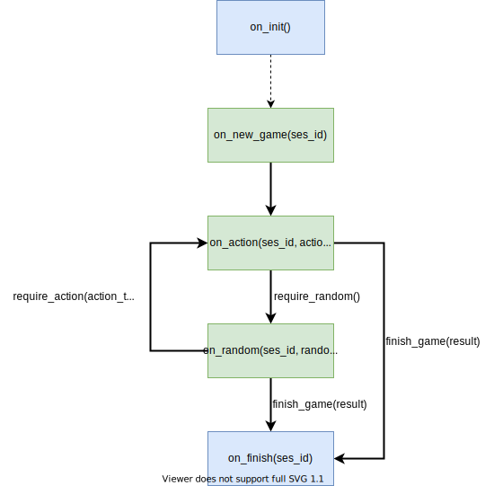
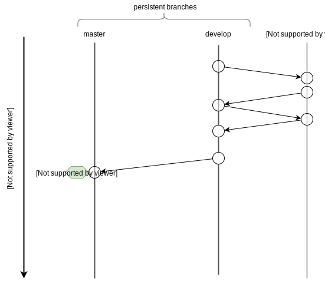

# Game SDK

## Build Status

Branch|Build Status
---|---
Master|[](https://travis-ci.org/DaoCasino/game-contract-sdk.svg?branch=master)
Develop|[](https://travis-ci.org/DaoCasino/game-contract-sdk.svg?branch=develop)

## Description
This SDK helps to develop game contracts which works with DAOPlatform based on DAOBet blockchain.

SDK implements all internal interactions with another DAOPlatform’s contracts and common functions under the hood, so now game developer can focus only on game logic implementation.

Main components:
- Contract SDK ([link](./sdk)) - header-only library which contain game base abstact class with game life-cycle logic and helper methods.
- Contract Tester ([link](./tester)) - header-only library that helps to unit test game contract. Tester provide full environment to write unit tests for game contract.
- Game examples ([link](./examples)) - game contracts and thier tests examples which writed using Game SDK.
 
# Try it

## Build
```bash
git clone https://github.com/DaoCasino/game-contract-sdk
cd game-contract-sdk
git submodule init
git submodule update --init
./cicd/run build
```
## Run unit tests
```bash
./cicd/run test
```
## Write own game
- Learn our examples
- Make repo with same structure as our example
- Connect this sdk as git submodule to your game repo
- Set `GAME_SDK_PATH` variable in your cmake with value of path to connected submodule.

# Game life-cycle

## Diagram


## Subjects

### Game session
Struct which contain all session related info including current state, deposit amount, etc. Game logic can read values from this table, but cant directly modify values.

```c++
enum class state : uint8_t {
    req_deposit = 0,        // <- init|req_signidice_part_2, -> req_start|req_action
    req_start,              // <- req_deposit, -> req_action|failed
    req_action,             // <- req_start|req_deposit, -> req_signidice_part_1|failed
    req_signidice_part_1,   // <- req_action, -> req_signidice_part_2|falied
    req_signidice_part_2,   // <- req_signidice_part_1, -> finished|req_deposit|req_action|failed
    finished,               // <- req_signidice_part_2
};

/* session struct */
struct [[eosio::table("session")]] session_row {
    uint64_t ses_id; // <- unique in this game scope session id 
    uint64_t casino_id;
    uint64_t ses_seq;
    name player;
    uint8_t state;
    game_params_type params; // <- game params, copied from casino contract avoid of params changing while active session
    asset deposit; // <- current player deposit amount, increments when new deposit received
    checksum256 digest; // <- signidice result, set seed value on new_game
    time_point last_update; // <-- last action time
    asset last_max_win; // <- last max win value, updates after on_action

    uint64_t primary_key() const { return ses_id; }
};
using session_table = eosio::multi_index<"session"_n, session_row>;
```

### Global state
Struct which contain global variables including total sessions amount, platform address. Game logic can read values from this table, but cant directly modify values.

```c++
/* global state variables */
struct [[eosio::table("global")]] global_row {
    uint64_t session_seq { 0u };
    name platform;
    name events
    uint32_t session_ttl
};
using global_singleton = eosio::singleton<"global"_n, global_row>;
```

### Handlers (function which invoked by game SDK)

#### on_init (optional)
Global contract initialization handler. Will invoked only once when game contract initialized.

#### on_new_game (required)
New game session handler. Invokes when game session started and received first deposit.

Arguments:
- ses_id - game session identifier

#### on_action (required)
Game action handler. Invokes when contract received game action from player. Before each game action contract can accept new deposit. Deposit amount can be tracked in this handler.

Arguments:
- ses_id - game session identifier
- action_type - received game action type
- params - game action params

#### on_random (required)
Signidice random value handler.

Arguments:
- ses_id - game session identifier
- random - random value as result of signidice protocol

#### on_finish (optional)
Game finalization hander. Invokes after all transfers and game session destroy.

Arguments:
- ses_id - game session identifier


### State changers (function which invoked by game logic)

#### require_action
Function which initiate action request from player. After this call contract will go to player action waiting state.

Arguments:
- action_type - requested action type


#### require_random
Function which initiate random generation process. After this call contract will go to random value waiting state.


#### finish_game
Function which initiate session destroying and transferring winner funds.

Arguments:
- player_win_amount - player winning amount

#### update_max_win
Function which change actual session max_win parameter. Should be called from on_action handler when max_win changed. max_win - parameter that shows maximum potential player winning(*total payout including player deposit*).

Arguments:
- new_max_win - new max_win amount

___
*Learn game examples to more clarify how it works([link](./examples)).*

# Contribution to game SDK
Interested in contributing? That's awesome! Please follow our git flow:



*NOTE: make rebase to actual develop before PR*
